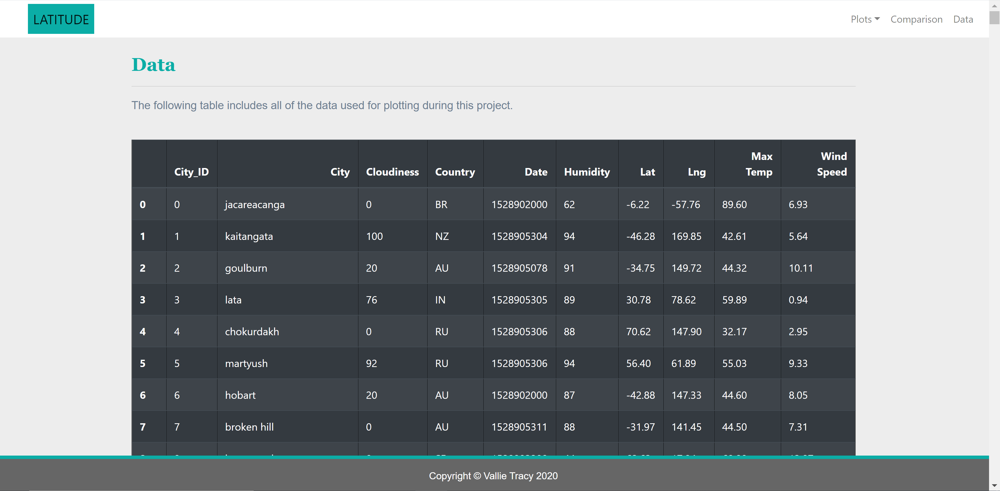

# A Webpage Visualization of Global Weather Patterns

#### *Finished Website:* 
https://vallietracy.github.io/Web-Design-Challenge/                

## Background

This is a continuation of my previous repo [`Global-Weather-Analysis`](https://github.com/VallieTracy/Global-Weather-Analysis).  In that repo, I gathered weather data for 600+ cities across the globe.  I looked specifically at Temperature, Cloudiness, Humidity, and Wind Speed.  I then performed linear regressions on the data, whose csv is in the `Resources` Folder of this repo, located at the root level.

In this repo, my aim was to visualize how weather patterns change with latitude thru graphs and written observation. 

